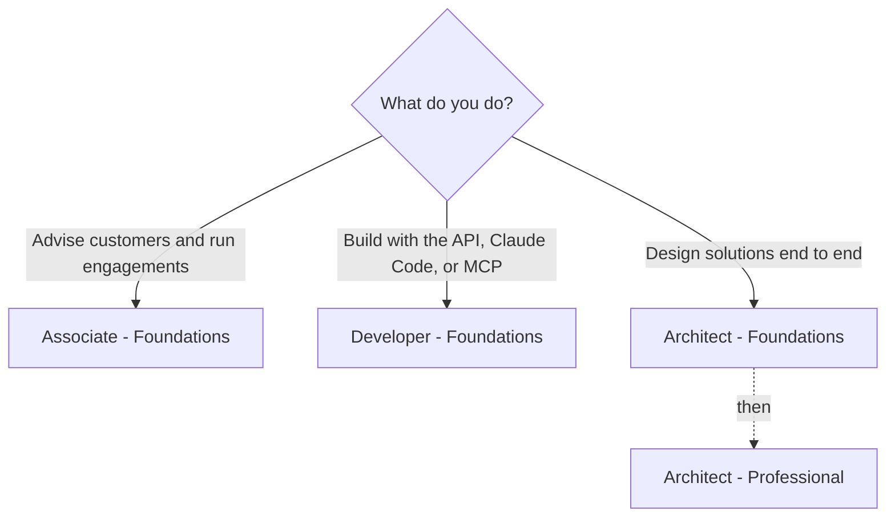

  

# Claude Certifications

**One place to prepare for every Anthropic Claude certification.** Official exam guides, blueprints, policies, courses, and study notes, collected and organized so you can spend your time studying, not searching.

This site is the readable version of the [CLAUDE-CERTIFICATIONS repository](https://github.com/Amey-Thakur/CLAUDE-CERTIFICATIONS), built and maintained by [Amey Thakur](https://github.com/Amey-Thakur) after completing the program's curriculum. It is a community resource, not an official Anthropic site: the official program lives on [Anthropic Partner Academy](https://anthropic-partners.skilljar.com/), and exams are delivered by [Pearson VUE](https://www.pearsonvue.com/us/en/anthropic.html).

> [!NOTE]
> I worked through every course and collected all of this while preparing myself. None of it required anything you do not already have: the official material is free, the blueprints tell you exactly what is tested, and the rest is steady work. I put it in one place so your time goes into learning rather than looking. If it helps you get certified, it did its job.
>
> — Amey

  <a class="github-button" href="https://github.com/Amey-Thakur/CLAUDE-CERTIFICATIONS" data-icon="octicon-star" data-size="large" data-show-count="true" aria-label="Star Amey-Thakur/CLAUDE-CERTIFICATIONS on GitHub">Star</a>
  <a class="github-button" href="https://github.com/Amey-Thakur/CLAUDE-CERTIFICATIONS/fork" data-icon="octicon-repo-forked" data-size="large" data-show-count="true" aria-label="Fork Amey-Thakur/CLAUDE-CERTIFICATIONS on GitHub">Fork</a>
  

## The certifications

| Certification | Questions | Fee | Study guide | Notes | Exam guide | Practice | Mock |
| --- | --- | --- | --- | --- | --- | --- | --- |
| Associate – Foundations | 60 | $99 | [Guide](associate-foundations/README.md) | [Notes](associate-foundations/notes.md) | [PDF](associate-foundations/exam-guide.pdf) | [Questions](associate-foundations/practice-questions.md) | [Mock](associate-foundations/mock-exam.md) |
| Developer – Foundations | 53 | $125 | [Guide](developer-foundations/README.md) | [Notes](developer-foundations/notes.md) | [PDF](developer-foundations/exam-guide.pdf) | [Questions](developer-foundations/practice-questions.md) | [Mock](developer-foundations/mock-exam.md) |
| Architect – Foundations | 60 | $125 | [Guide](architect-foundations/README.md) | [Notes](architect-foundations/notes.md) | [PDF](architect-foundations/exam-guide.pdf) | [Questions](architect-foundations/practice-questions.md) | [Mock](architect-foundations/mock-exam.md) |
| Architect – Professional | 63 | $175 | [Guide](architect-professional/README.md) | [Notes](architect-professional/notes.md) | [PDF](architect-professional/exam-guide.pdf) | [Questions](architect-professional/practice-questions.md) | [Mock](architect-professional/mock-exam.md) |

Every exam: 120 minutes, closed book, proctored by Pearson VUE online or at a test center, passing score 720 of 1,000, credential valid 12 months with free renewal, badge via Credly. Fees are list prices in USD; partner tiers receive automatic discounts. Registration requires a Claude Partner Network company email.

## Start here

1. **Pick your exam** with the table above, or read [how the certifications connect](guide/learning-paths.md).
2. **Study** with your exam's study guide and notes, the [study strategy](guide/study-strategy.md), the [21 official courses](guide/courses.md) and [official resources](guide/resources.md) that teach the material, and the [practice engine](guide/quiz.md) to test yourself: a shuffled, timed, scored exam drawn from 100 original questions.
3. **Book and sit** with the [registration guide](guide/registration.md); [policies](guide/policies.md) and the [FAQ](guide/faq.md) cover the rest.

## The maintainer's certificates

All twenty-one Anthropic Academy course completion certificates behind this program, each with its issued PDF and Skilljar verification record: [browse the gallery](certificates/README.md).

## Official links

| Resource | Link |
| --- | --- |
| Partner Academy home | [anthropic-partners.skilljar.com](https://anthropic-partners.skilljar.com/) |
| Certifications overview and registration | [Certifications page](https://anthropic-partners.skilljar.com/page/partner-certifications) |
| Prep courses | [Exam prep courses](https://anthropic-partners.skilljar.com/page/claude-certification-exam-prep-courses) |
| Pearson VUE for Anthropic | [pearsonvue.com/us/en/anthropic](https://www.pearsonvue.com/us/en/anthropic.html) |
| OnVUE system test | [system-test.onvue.com](https://system-test.onvue.com) |
| Become a partner | [claude.com/partners](https://claude.com/partners) |

## Questions and community

Ask questions and compare preparation notes in [GitHub Discussions](https://github.com/Amey-Thakur/CLAUDE-CERTIFICATIONS/discussions). Found a broken link or an outdated fact? [Open an issue](https://github.com/Amey-Thakur/CLAUDE-CERTIFICATIONS/issues/new/choose).

> [!IMPORTANT]
> Every candidate accepts a non-disclosure agreement covering exam questions, answer options, and scenarios, and it extends explicitly to online forums. Never post or request real exam content there. Blueprints, official sample questions, and the practice material in this repository are all fair game.

---

  
  

  Not affiliated with or endorsed by Anthropic. Claude and Anthropic are trademarks of Anthropic PBC. 
  Repository text is <a href="https://github.com/Amey-Thakur/CLAUDE-CERTIFICATIONS/blob/main/LICENSE">MIT licensed</a>; mirrored documents keep their own <a href="guide/official-sources.html">provenance</a>.

