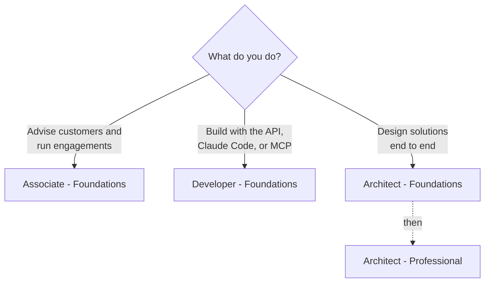

# Claude Certifications

**One place to prepare for every Anthropic Claude certification.**

Official exam guides, blueprints, policies, courses, and study notes,
collected and organized so you can spend your time studying, not searching.

[Certifications](#the-certifications) · [Start here](#start-here) · [Program guide](guide/README.md) · [Certificates](certificates/README.md) · [Discussions](https://github.com/Amey-Thakur/CLAUDE-CERTIFICATIONS/discussions)

---

Built and maintained by [Amey Thakur](https://github.com/Amey-Thakur) after completing the program's curriculum. This is a community resource, not an official Anthropic repository: the official program lives on [Anthropic Partner Academy](https://anthropic-partners.skilljar.com/), and exams are delivered by [Pearson VUE](https://www.pearsonvue.com/us/en/anthropic.html).

## The certifications

Each certification has its own folder containing the study guide, the official exam guide PDF, and the maintainer's study notes.

| Certification | Questions | Fee | Study guide | Exam guide | Notes |
| --- | --- | --- | --- | --- | --- |
| Associate – Foundations | 60 | $99 | [Guide](associate-foundations/README.md) | [PDF](associate-foundations/exam-guide.pdf) | [Notes](associate-foundations/notes.md) |
| Developer – Foundations | 53 | $125 | [Guide](developer-foundations/README.md) | [PDF](developer-foundations/exam-guide.pdf) | [Notes](developer-foundations/notes.md) |
| Architect – Foundations | 60 | $125 | [Guide](architect-foundations/README.md) | [PDF](architect-foundations/exam-guide.pdf) | [Notes](architect-foundations/notes.md) |
| Architect – Professional | 63 | $175 | [Guide](architect-professional/README.md) | [PDF](architect-professional/exam-guide.pdf) | [Notes](architect-professional/notes.md) |

Every exam: 120 minutes, closed book, proctored by Pearson VUE online or at a test center, passing score 720 of 1,000, credential valid 12 months with free renewal, badge via Credly. Fees are list prices in USD; partner tiers receive automatic discounts. Registration requires a Claude Partner Network company email.

## Start here

1. **Pick your exam.** Advising customers: [Associate](associate-foundations/README.md). Building with the API, Claude Code, or MCP: [Developer](developer-foundations/README.md). Designing solutions end to end: [Architect Foundations](architect-foundations/README.md), then [Architect Professional](architect-professional/README.md). Unsure: [how the certifications connect](guide/learning-paths.md).
2. **Study.** Read your exam's study guide and notes, then the [study strategy](guide/study-strategy.md) for a working plan and the [courses](guide/learning-paths.md) that prepare for it.
3. **Book and sit.** The [registration guide](guide/registration.md) covers everything from partner email issues to the proctoring network allowlist. Policies on retakes, validity, and appeals are in [policies](guide/policies.md), and quick answers in the [FAQ](guide/faq.md).

## What is where

| Folder | Contents |
| --- | --- |
| [associate-foundations](associate-foundations/) · [developer-foundations](developer-foundations/) · [architect-foundations](architect-foundations/) · [architect-professional](architect-professional/) | One folder per certification: study guide, official exam guide PDF, study notes |
| [guide](guide/) | Program-wide pages: learning paths, study strategy, registration, policies, FAQ, plus the official policy PDFs and their [provenance](guide/official-sources.md) |
| [certificates](certificates/) | The maintainer's 21 Anthropic Academy course certificates, with previews and verification links |
| [scripts](scripts/) | Keeps the mirrored official PDFs current |

## Questions and community

Ask questions, share how your exam went, and compare preparation notes in [Discussions](https://github.com/Amey-Thakur/CLAUDE-CERTIFICATIONS/discussions). One firm rule from the exam NDA: never post real exam questions or answers. Found a broken link or an outdated fact? [Open an issue](https://github.com/Amey-Thakur/CLAUDE-CERTIFICATIONS/issues/new/choose).

Contributions that keep facts current are welcome; see [CONTRIBUTING.md](CONTRIBUTING.md).

---

<picture>
  <source media="(prefers-color-scheme: dark)" srcset="assets/logos/anthropic-wordmark-dark.svg">
  
</picture>

Not affiliated with or endorsed by Anthropic. Claude and Anthropic are trademarks of Anthropic PBC. 
Repository text is <a href="LICENSE">MIT licensed</a>; mirrored documents and logo artwork keep their own provenance
(<a href="guide/official-sources.md">sources</a>, <a href="assets/logos/README.md">logos</a>).

