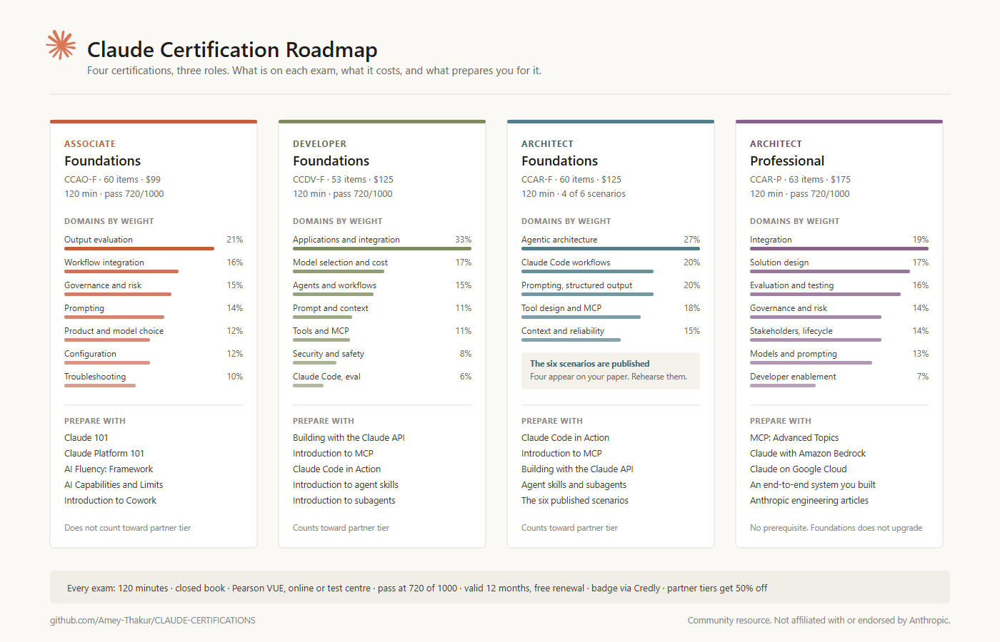
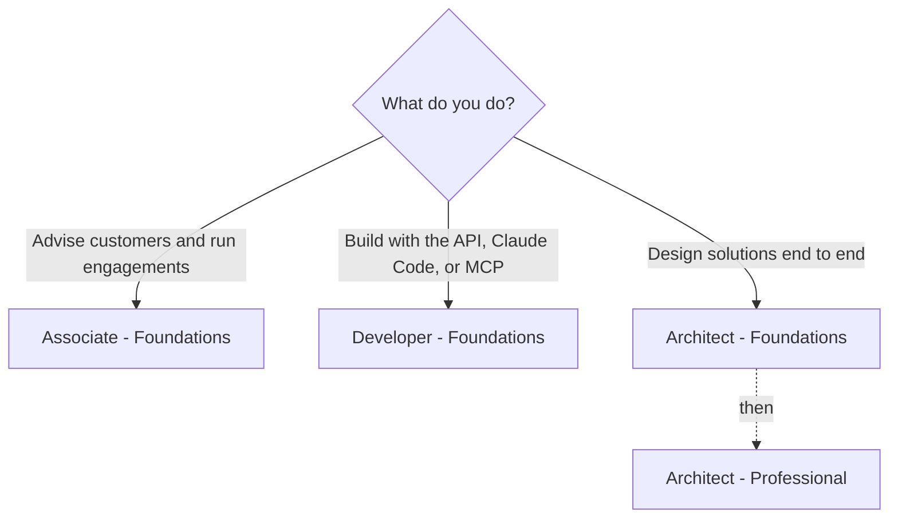
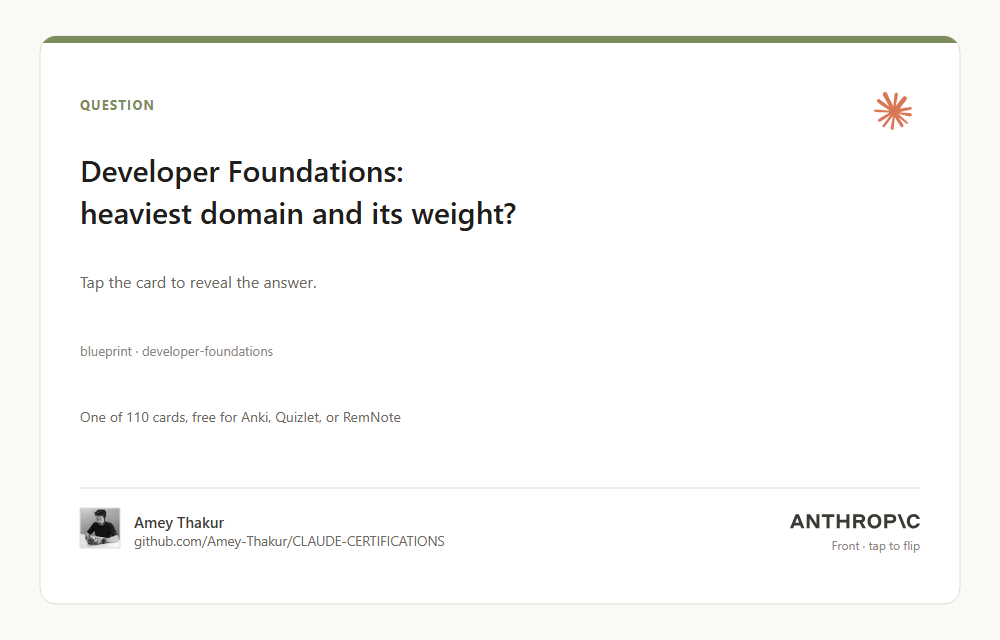
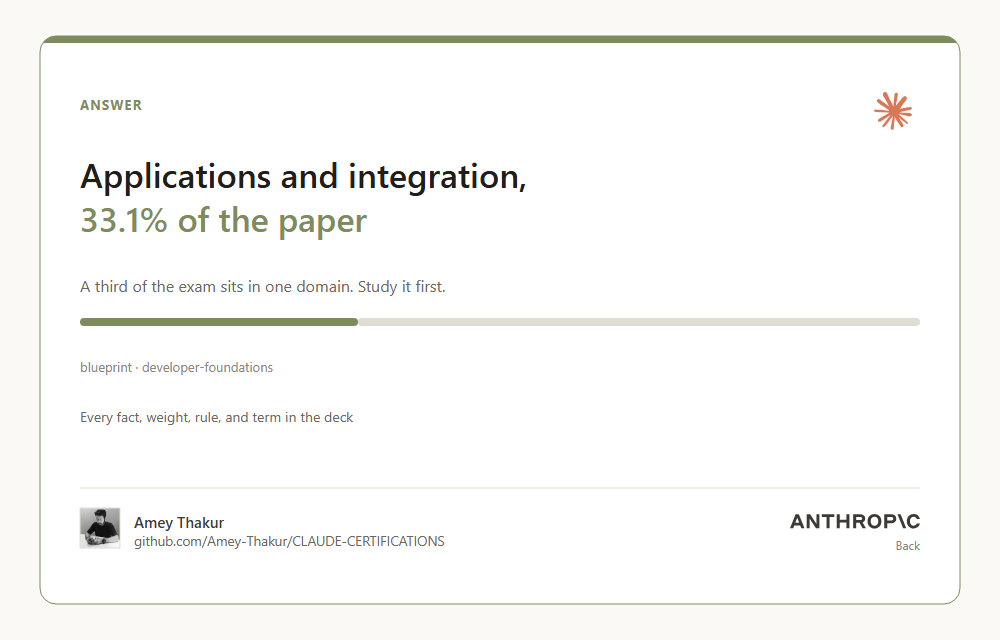

# Claude Certifications

**One place to prepare for every Anthropic Claude certification.**

Official exam guides, blueprints, policies, courses, and study notes,
collected and organized so you can spend your time studying, not searching.

[Website](https://amey-thakur.github.io/CLAUDE-CERTIFICATIONS/) · [Certifications](#the-certifications) · [Start here](#start-here) · [Program guide](guide/README.md) · [Certificates](certificates/README.md) · [Discussions](https://github.com/Amey-Thakur/CLAUDE-CERTIFICATIONS/discussions)

**[Download the booklet (PDF)](claude-certifications-booklet.pdf)** · the whole guide in one printable file

---

Built and maintained by [Amey Thakur](https://github.com/Amey-Thakur) after completing the program's curriculum. This is a community resource, not an official Anthropic repository: the official program lives on [Anthropic Partner Academy](https://anthropic-partners.skilljar.com/), and exams are delivered by [Pearson VUE](https://www.pearsonvue.com/us/en/anthropic.html).

> [!NOTE]
> I worked through every course and collected all of this while preparing myself. None of it required anything you do not already have: the official material is free, the blueprints tell you exactly what is tested, and the rest is steady work. I put it in one place so your time goes into learning rather than looking. If it helps you get certified, it did its job.
>
> — Amey

## The certifications

Each certification has its own folder containing the study guide, the official exam guide PDF, the maintainer's study notes, and original practice questions.

| Certification | Questions | Fee | Study guide | Exam guide | Notes | Practice | Mocks | Cheat sheet |
| --- | --- | --- | --- | --- | --- | --- | --- | --- |
| Associate – Foundations | 60 | $99 | [Guide](associate-foundations/README.md) | [PDF](associate-foundations/exam-guide.pdf) | [Notes](associate-foundations/notes.md) | [Questions](associate-foundations/practice-questions.md) | [1](associate-foundations/mock-exam.md) · [2](associate-foundations/mock-exam-2.md) · [3](associate-foundations/mock-exam-3.md) | [Sheet](associate-foundations/cheat-sheet.md) |
| Developer – Foundations | 53 | $125 | [Guide](developer-foundations/README.md) | [PDF](developer-foundations/exam-guide.pdf) | [Notes](developer-foundations/notes.md) | [Questions](developer-foundations/practice-questions.md) | [1](developer-foundations/mock-exam.md) · [2](developer-foundations/mock-exam-2.md) · [3](developer-foundations/mock-exam-3.md) | [Sheet](developer-foundations/cheat-sheet.md) |
| Architect – Foundations | 60 | $125 | [Guide](architect-foundations/README.md) | [PDF](architect-foundations/exam-guide.pdf) | [Notes](architect-foundations/notes.md) | [Questions](architect-foundations/practice-questions.md) | [1](architect-foundations/mock-exam.md) · [2](architect-foundations/mock-exam-2.md) · [3](architect-foundations/mock-exam-3.md) | [Sheet](architect-foundations/cheat-sheet.md) |
| Architect – Professional | 63 | $175 | [Guide](architect-professional/README.md) | [PDF](architect-professional/exam-guide.pdf) | [Notes](architect-professional/notes.md) | [Questions](architect-professional/practice-questions.md) | [1](architect-professional/mock-exam.md) · [2](architect-professional/mock-exam-2.md) · [3](architect-professional/mock-exam-3.md) | [Sheet](architect-professional/cheat-sheet.md) |

Every exam: 120 minutes, closed book, proctored by Pearson VUE online or at a test center, passing score 720 of 1,000, credential valid 12 months with free renewal, badge via Credly. Fees are list prices in USD; partner tiers receive automatic discounts. Registration requires a Claude Partner Network company email.

> [!TIP]
> Every course in the program is free on the public [Anthropic Academy](https://anthropic.skilljar.com/), no partner account needed. Only the proctored exams require Claude Partner Network membership, so you can learn the whole syllabus before deciding whether to certify.
>
> Prefer one file? The whole guide is a printable booklet: [claude-certifications-booklet.pdf](claude-certifications-booklet.pdf), twenty-eight pages in five parts: choose your exam, know it, prepare, sit it, and keep going.

## Start here

1. **Pick your exam.** Advising customers: [Associate](associate-foundations/README.md). Building with the API, Claude Code, or MCP: [Developer](developer-foundations/README.md). Designing solutions end to end: [Architect Foundations](architect-foundations/README.md), then [Architect Professional](architect-professional/README.md). Unsure: [how the certifications connect](guide/learning-paths.md).
2. **Study.** Read your exam's study guide and notes, then the [study strategy](guide/study-strategy.md) for a working plan, the [21 official courses](guide/courses.md) with [per-course notes](guide/course-notes.md) and [official resources](guide/resources.md) that teach the material, and the [practice engine](guide/quiz.md) to test yourself: a shuffled, timed, scored exam drawn from 320 original questions. Clone the repository and open Claude Code inside it, and the built-in [exam coach skill](.claude/skills/exam-coach/SKILL.md) quizzes you directly from the blueprints.
3. **Book and sit.** The [registration guide](guide/registration.md) covers everything from partner email issues to the proctoring network allowlist. Policies on retakes, validity, and appeals are in [policies](guide/policies.md), and quick answers in the [FAQ](guide/faq.md).

## Flashcards

Every fact, domain weight, rule, and glossary term in this repository, as a deck of 110 cards. Turn them in the browser on the [flashcards page](https://amey-thakur.github.io/CLAUDE-CERTIFICATIONS/guide/flashcards.html), filtered by exam or by topic, or take [flashcards.tsv](flashcards.tsv) and import the whole deck into Anki, Quizlet, or RemNote.

 

## What is where

| Folder | Contents |
| --- | --- |
| [associate-foundations](associate-foundations/) · [developer-foundations](developer-foundations/) · [architect-foundations](architect-foundations/) · [architect-professional](architect-professional/) | One folder per certification: study guide, official exam guide PDF, study notes, practice questions |
| [guide](guide/) | Program-wide pages: learning paths, study strategy, official resources, practice, registration, policies, FAQ, and glossary, plus the official policy PDFs and their [provenance](guide/official-sources.md) |
| [certificates](certificates/) | The maintainer's 21 Anthropic Academy course certificates, with previews and verification links |
| [.github](.github/) | Repository housekeeping: CI, templates, logo assets, and the [script](.github/scripts/update_resources.py) that keeps mirrored PDFs current |

## Questions and community

Ask questions, share how your exam went, and compare preparation notes in [Discussions](https://github.com/Amey-Thakur/CLAUDE-CERTIFICATIONS/discussions). Found a broken link or an outdated fact? [Open an issue](https://github.com/Amey-Thakur/CLAUDE-CERTIFICATIONS/issues/new/choose).

> [!IMPORTANT]
> Every candidate accepts a non-disclosure agreement covering exam questions, answer options, and scenarios, and it extends explicitly to online forums. Never post or request real exam content here. Blueprints, official sample questions, and the practice material in this repository are all fair game.

Preparing someone else? The [share kit](guide/share.md) has the links, ready-to-use copy, and images.

Contributions that keep facts current are welcome; see [CONTRIBUTING.md](.github/CONTRIBUTING.md).

---

<a href="https://www.anthropic.com" title="Anthropic">
<picture>
  <source media="(prefers-color-scheme: dark)" srcset=".github/assets/logos/anthropic-wordmark-dark.svg">
  
</picture>
</a>

Not affiliated with or endorsed by Anthropic. Claude and Anthropic are trademarks of Anthropic PBC. 
Repository text is <a href="LICENSE">MIT licensed</a>; mirrored documents and logo artwork keep their own provenance
(<a href="guide/official-sources.md">sources</a>, <a href=".github/assets/logos/README.md">logos</a>).

