

<a href="https://www.anthropic.com" title="Anthropic">
<picture>
  <source media="(prefers-color-scheme: dark)" srcset="../.github/assets/logos/anthropic-wordmark-dark.svg">
  
</picture>
</a>

# Course completion certificates

**Every one of the twenty-five things Claude Academy publishes behind the certification program, completed by [Amey Thakur](https://github.com/Amey-Thakur).** Twenty-four courses and a tutorial. Twenty-two of them issued a certificate and twenty-three issued a completion badge, twenty-four badges in all because one course issued two. The rest issue neither, which is why the galleries are shorter than the catalog.

Every certificate links to its issued PDF and its Skilljar verification record, which carries the completion date shown.

> [!NOTE]
> **Two badges, one course.** AI Fluency for Creative Work was issued a completion badge on 22 August 2026 and again on 27 August 2026. Both verify on Anthropic's own domain, so both are shown: twenty-four badges across twenty-three courses.

Course completion certificates are distinct from the certification credentials themselves, which are issued as Credly badges after a proctored exam. Source copies live in the maintainer's [ACHIEVEMENTS repository](https://github.com/Amey-Thakur/ACHIEVEMENTS#anthropic-courses); course descriptions and enrollment links are in [Anthropic courses](../guide/courses.md).

## Claude platform

<table>
<tr>
<td align="center" width="33%">
<a href="claude-101.pdf">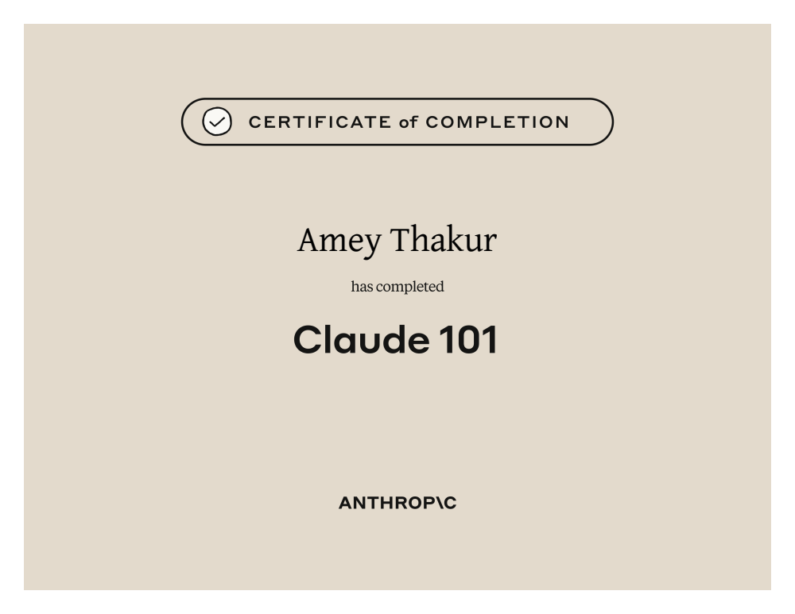</a> 
<b>Claude 101</b> 
<a href="claude-101.pdf">PDF</a> · <a href="https://verify.skilljar.com/c/za6zqtc6jkt6">Verify</a> · <a href="https://academy.claude.com/verify/13103f134da7befe9615ec2adfc8c50e">Badge</a> · Completed March 13, 2026
</td>
<td align="center" width="33%">
<a href="claude-platform-101.pdf">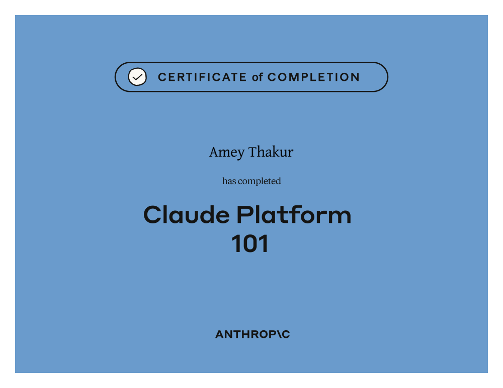</a> 
<b>Claude Platform 101</b> 
<a href="claude-platform-101.pdf">PDF</a> · <a href="https://verify.skilljar.com/c/pz4hgm2px76r">Verify</a> · <a href="https://academy.claude.com/verify/c916ad7d1190ea2447bb2fcf3809ef16">Badge</a> · Completed June 10, 2026
</td>
<td align="center" width="33%">
<a href="claude-code-101.pdf">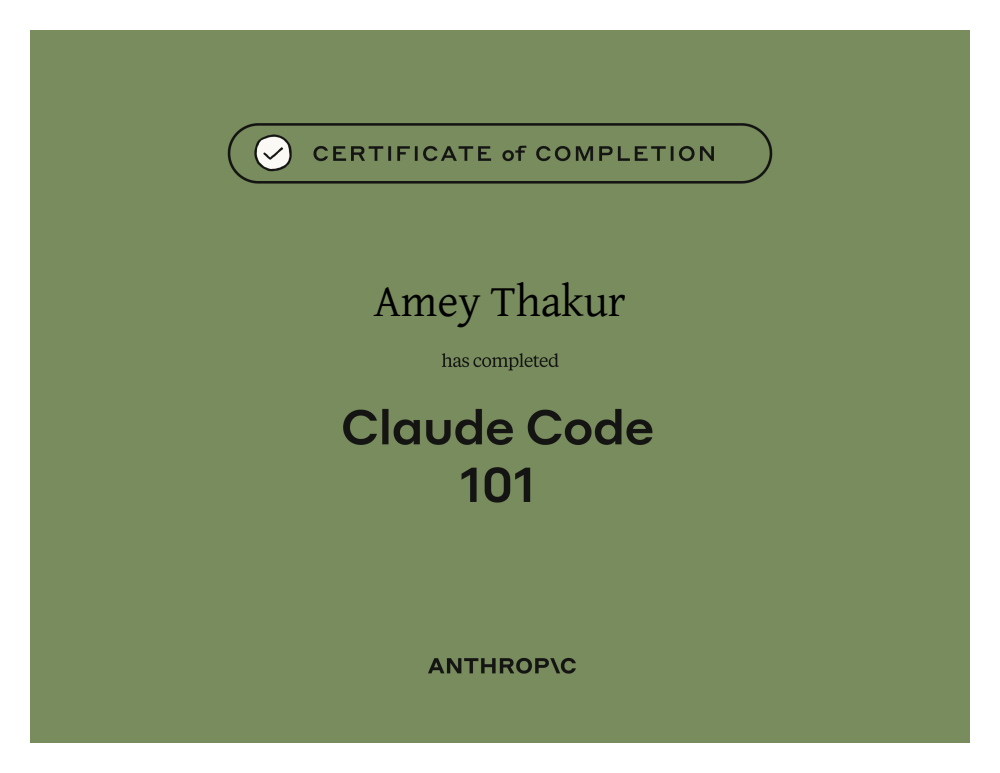</a> 
<b>Claude Code 101</b> 
<a href="claude-code-101.pdf">PDF</a> · <a href="https://verify.skilljar.com/c/wbf7fherdhsx">Verify</a> · <a href="https://academy.claude.com/verify/47482157d8dbc48e39d22aaa49d6d9b1">Badge</a> · Completed April 13, 2026
</td>
</tr>
<tr>
<td align="center" width="33%">
<a href="claude-code-in-action.pdf">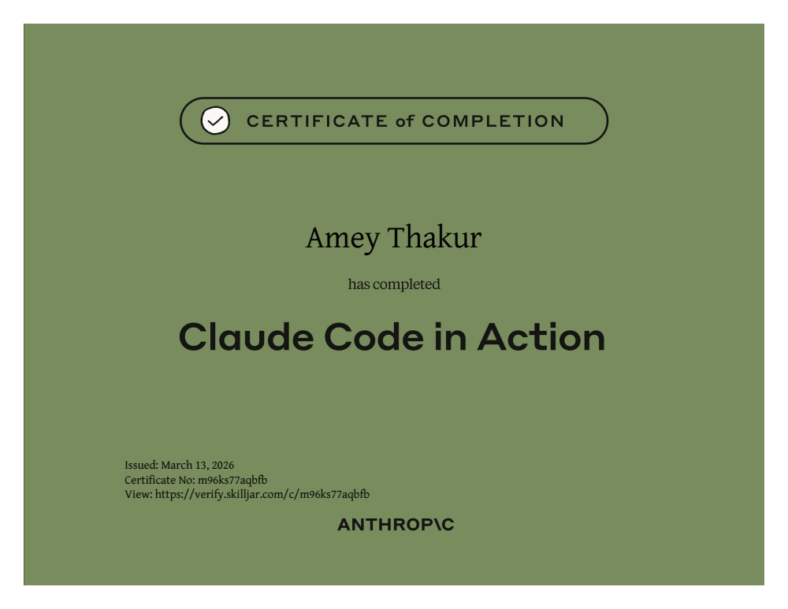</a> 
<b>Claude Code in Action</b> 
<a href="claude-code-in-action.pdf">PDF</a> · <a href="https://verify.skilljar.com/c/m96ks77aqbfb">Verify</a> · <a href="https://academy.claude.com/verify/7f0839f0576b57f38658e8784e4c9a83">Badge</a> · Completed March 13, 2026
</td>
<td align="center" width="33%">
<a href="introduction-to-claude-cowork.pdf">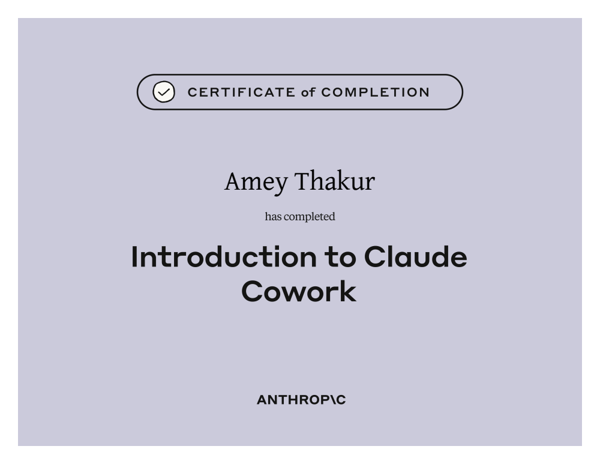</a> 
<b>Introduction to Claude Cowork</b> 
<a href="introduction-to-claude-cowork.pdf">PDF</a> · <a href="https://verify.skilljar.com/c/n63skaqkpxs8">Verify</a> · <a href="https://academy.claude.com/verify/7e0320325938630d9536a61078cc69a9">Badge</a> · Completed March 27, 2026
</td>
</tr>
</table>

## Developer and integration

<table>
<tr>
<td align="center" width="33%">
<a href="building-with-the-claude-api.pdf">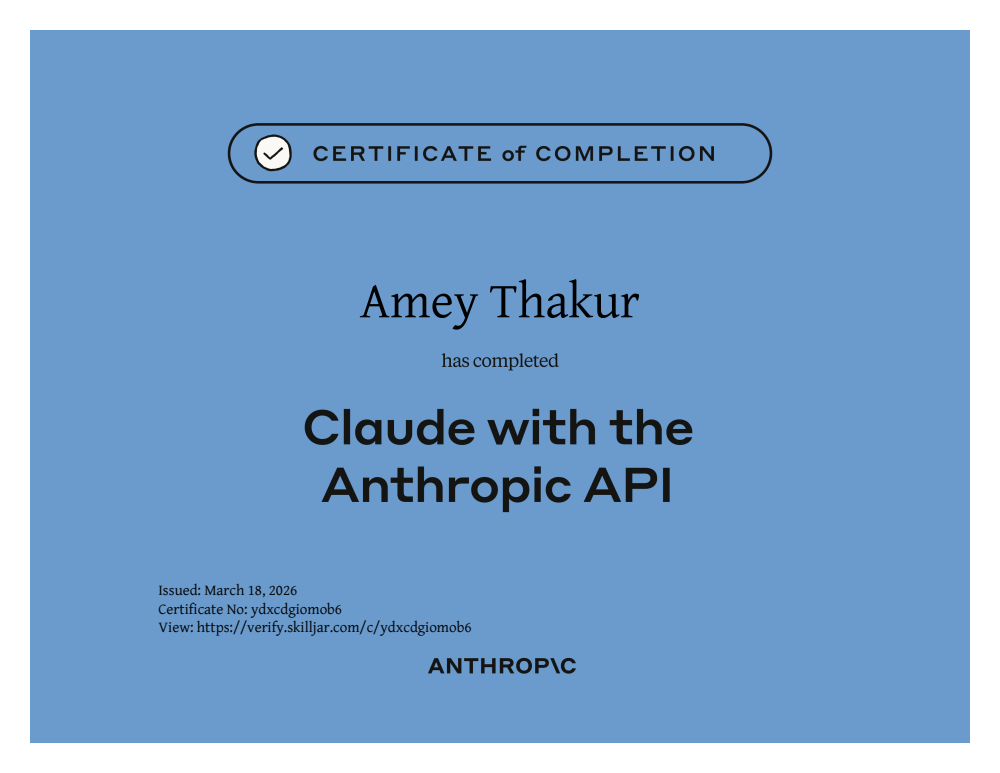</a> 
<b>Building with the Claude API</b> 
<a href="building-with-the-claude-api.pdf">PDF</a> · <a href="https://verify.skilljar.com/c/ydxcdgiomob6">Verify</a> · <a href="https://academy.claude.com/verify/f6a1826e7f9054f5e41bf340a402fe58">Badge</a> · Completed March 18, 2026
</td>
<td align="center" width="33%">
<a href="introduction-to-model-context-protocol.pdf">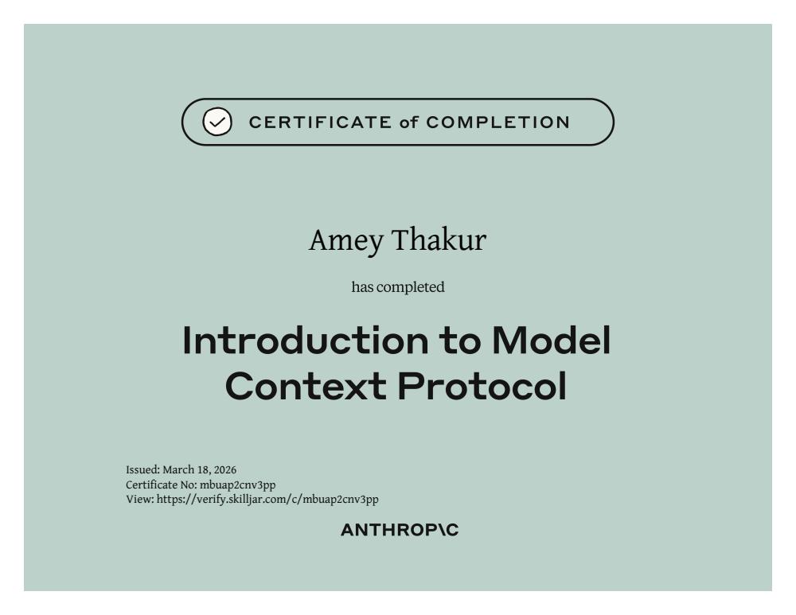</a> 
<b>Introduction to Model Context Protocol</b> 
<a href="introduction-to-model-context-protocol.pdf">PDF</a> · <a href="https://verify.skilljar.com/c/mbuap2cnv3pp">Verify</a> · <a href="https://academy.claude.com/verify/0377c528acb2ecff93695ef9a9b56369">Badge</a> · Completed March 18, 2026
</td>
<td align="center" width="33%">
<a href="model-context-protocol-advanced-topics.pdf">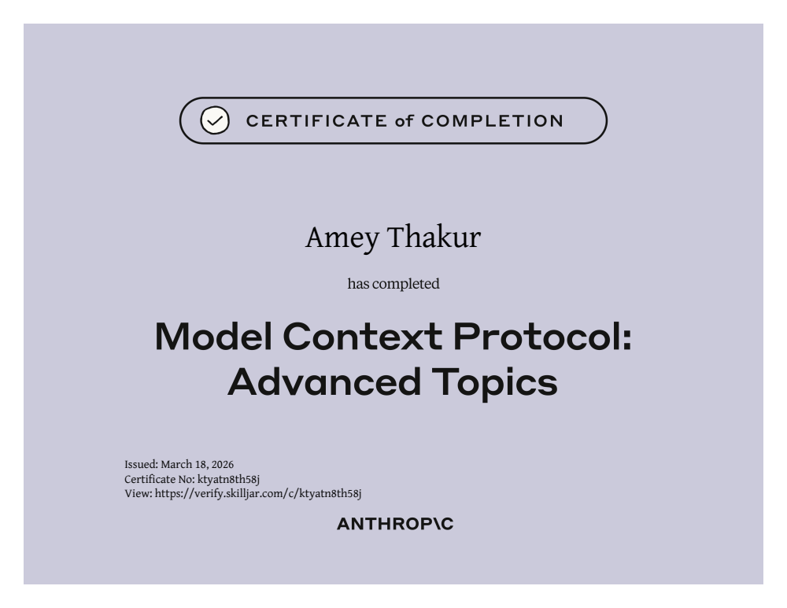</a> 
<b>Model Context Protocol: Advanced Topics</b> 
<a href="model-context-protocol-advanced-topics.pdf">PDF</a> · <a href="https://verify.skilljar.com/c/ktyatn8th58j">Verify</a> · <a href="https://academy.claude.com/verify/f7904c762c678c6e136bc866545a47e4">Badge</a> · Completed March 18, 2026
</td>
</tr>
<tr>
<td align="center" width="33%">
<a href="introduction-to-agent-skills.pdf">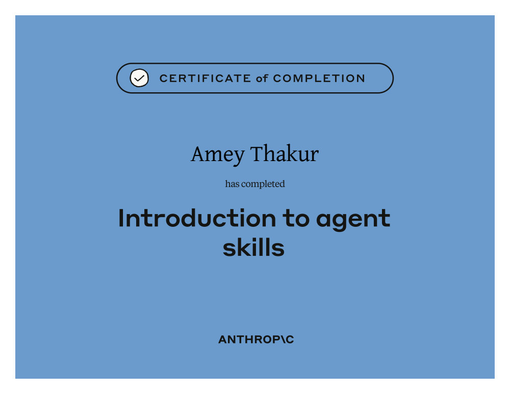</a> 
<b>Introduction to agent skills</b> 
<a href="introduction-to-agent-skills.pdf">PDF</a> · <a href="https://verify.skilljar.com/c/2jxpxwmqdcyp">Verify</a> · Completed March 18, 2026
</td>
<td align="center" width="33%">
<a href="introduction-to-subagents.pdf">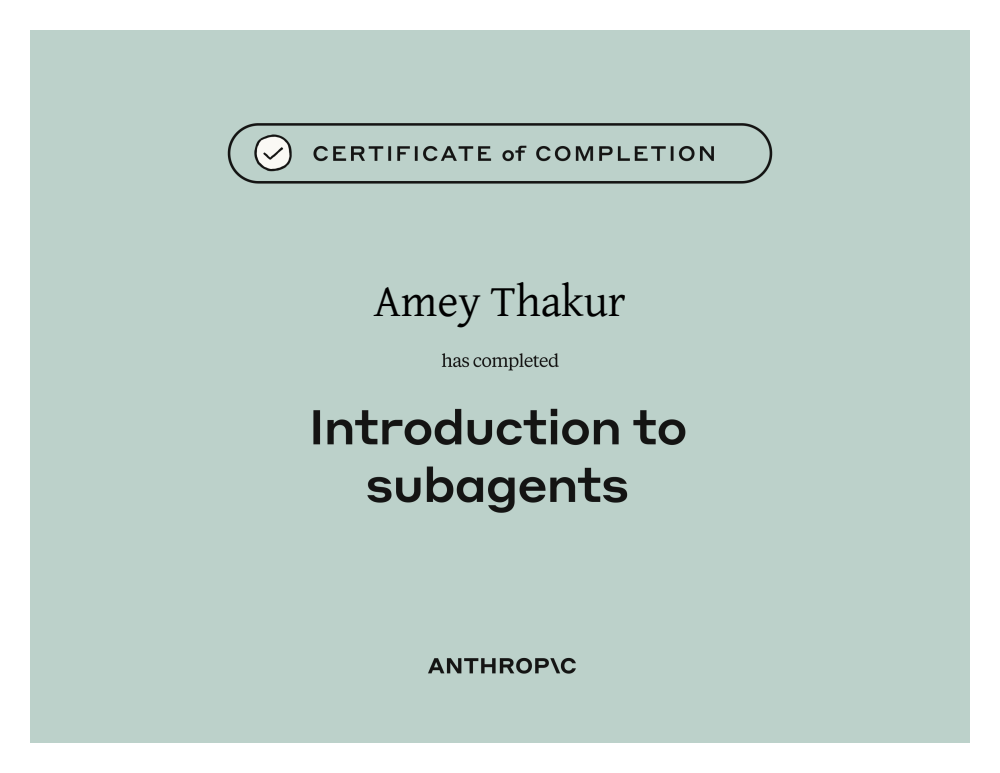</a> 
<b>Introduction to subagents</b> 
<a href="introduction-to-subagents.pdf">PDF</a> · <a href="https://verify.skilljar.com/c/yrz3errg7n2g">Verify</a> · Completed March 27, 2026
</td>
</tr>
</table>

## Deployment platforms

<table>
<tr>
<td align="center" width="33%">
<a href="claude-with-amazon-bedrock.pdf">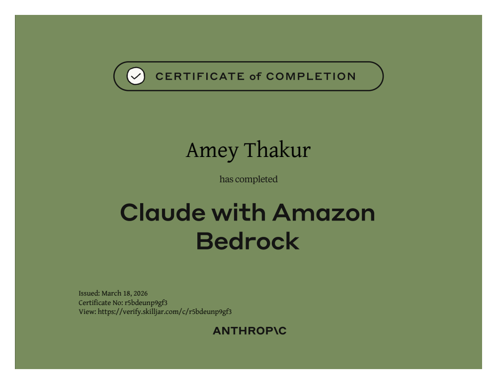</a> 
<b>Claude with Amazon Bedrock</b> 
<a href="claude-with-amazon-bedrock.pdf">PDF</a> · <a href="https://verify.skilljar.com/c/r5bdeunp9gf3">Verify</a> · <a href="https://academy.claude.com/verify/8fb5e32058c121d343c34e341f56f375">Badge</a> · Completed March 18, 2026
</td>
<td align="center" width="33%">
<a href="claude-with-google-clouds-vertex-ai.pdf">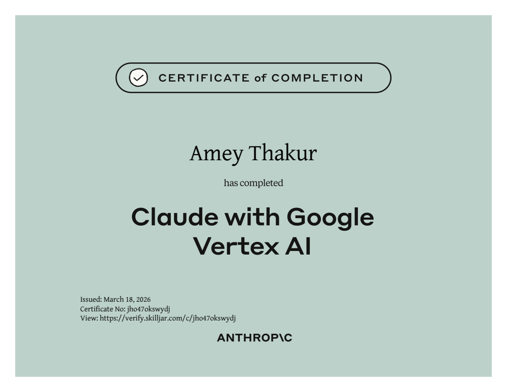</a> 
<b>Claude on Google Cloud</b> 
<a href="claude-with-google-clouds-vertex-ai.pdf">PDF</a> · <a href="https://verify.skilljar.com/c/jho47okswydj">Verify</a> · <a href="https://academy.claude.com/verify/7ba0a150a9136308e1efa4b708fd9815">Badge</a> · Completed March 18, 2026
</td>
</tr>
</table>

## AI Fluency

<table>
<tr>
<td align="center" width="33%">
<a href="ai-fluency-framework-and-foundations.pdf">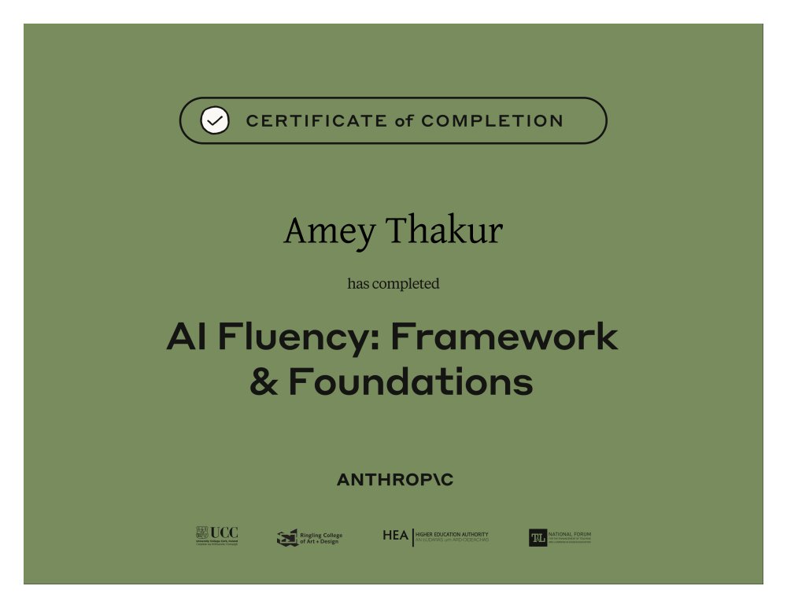</a> 
<b>AI Fluency: Framework &amp; Foundations</b> 
<a href="ai-fluency-framework-and-foundations.pdf">PDF</a> · <a href="https://verify.skilljar.com/c/9hxb9b5rtg3p">Verify</a> · <a href="https://academy.claude.com/verify/707d8089647cf8c2a99e833811ef8411">Badge</a> · Completed March 14, 2026
</td>
<td align="center" width="33%">
<a href="ai-capabilities-and-limitations.pdf">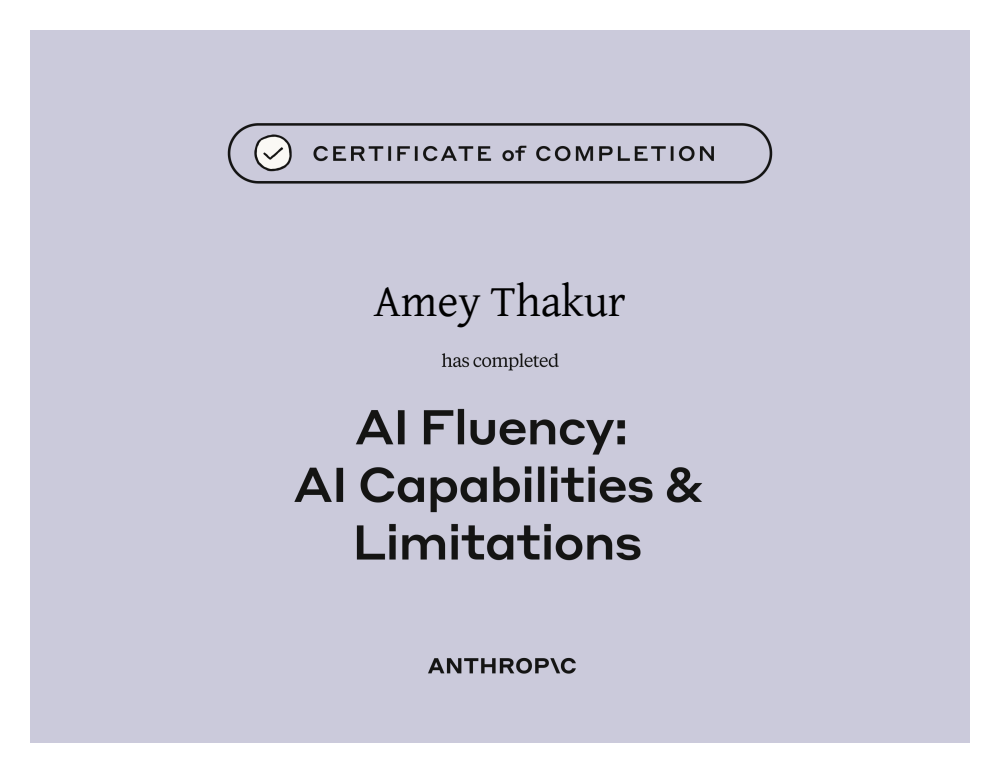</a> 
<b>AI Capabilities and Limitations</b> 
<a href="ai-capabilities-and-limitations.pdf">PDF</a> · <a href="https://verify.skilljar.com/c/csuadcoxmf92">Verify</a> · <a href="https://academy.claude.com/verify/09810945e075b401092e66d40dca790b">Badge</a> · Completed April 13, 2026
</td>
<td align="center" width="33%">
<a href="ai-fluency-for-builders.pdf">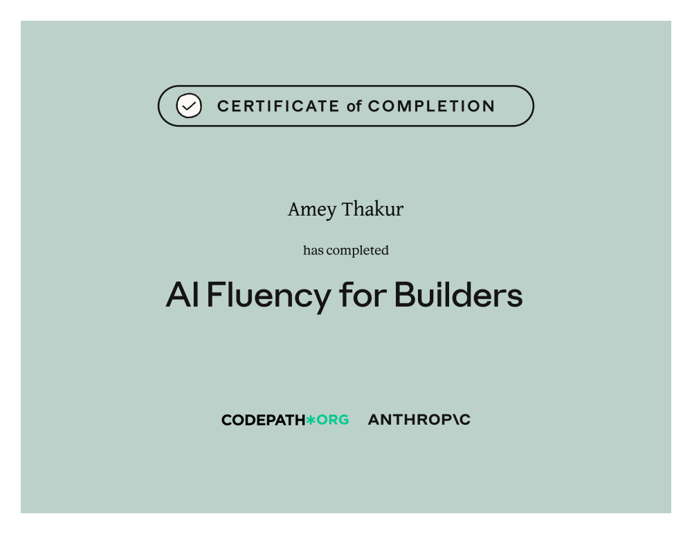</a> 
<b>AI Fluency for Builders</b> 
<a href="ai-fluency-for-builders.pdf">PDF</a> · <a href="https://verify.skilljar.com/c/vtcjxoedi39k">Verify</a> · <a href="https://academy.claude.com/verify/6b67e458243ba97237de011382e2bedf">Badge</a> · Completed July 10, 2026
</td>
</tr>
<tr>
<td align="center" width="33%">
<a href="ai-fluency-for-educators.pdf">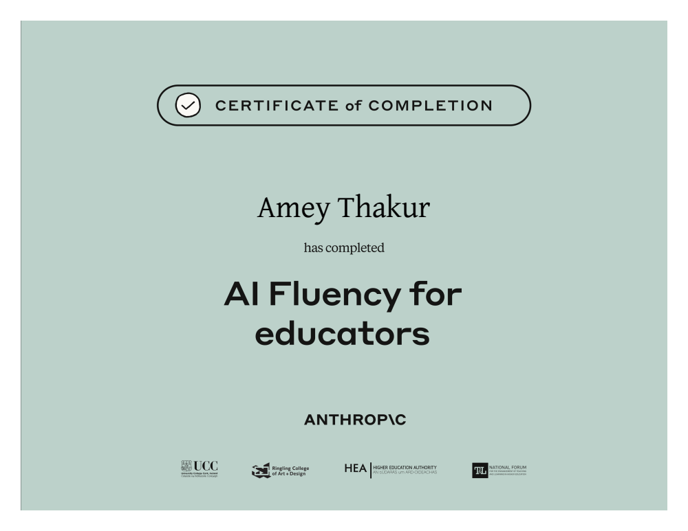</a> 
<b>AI Fluency for educators</b> 
<a href="ai-fluency-for-educators.pdf">PDF</a> · <a href="https://verify.skilljar.com/c/qteo2nkjtrhp">Verify</a> · <a href="https://academy.claude.com/verify/3b7797440c1c56ed02ce4311c95313f1">Badge</a> · Completed March 18, 2026
</td>
<td align="center" width="33%">
<a href="ai-fluency-for-pk-12-educators.pdf">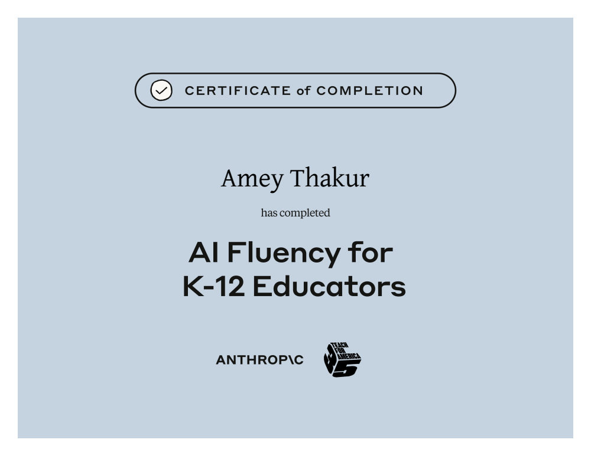</a> 
<b>AI Fluency for pK-12 Educators</b> 
<a href="ai-fluency-for-pk-12-educators.pdf">PDF</a> · <a href="https://verify.skilljar.com/c/hhc5c3uo3nw3">Verify</a> · <a href="https://academy.claude.com/verify/e8df6427179f879404b68f93cdbbb1b6">Badge</a> · Completed July 22, 2026
</td>
<td align="center" width="33%">
<a href="ai-fluency-for-students.pdf">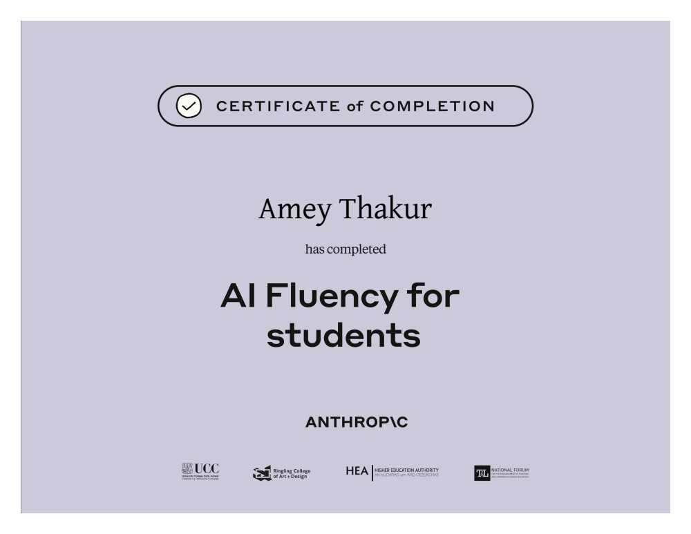</a> 
<b>AI Fluency for students</b> 
<a href="ai-fluency-for-students.pdf">PDF</a> · <a href="https://verify.skilljar.com/c/2t46zznf8d6c">Verify</a> · <a href="https://academy.claude.com/verify/84c728c31bdfe38efa149672b5477163">Badge</a> · Completed March 18, 2026
</td>
</tr>
<tr>
<td align="center" width="33%">
<a href="ai-fluency-for-nonprofits.pdf">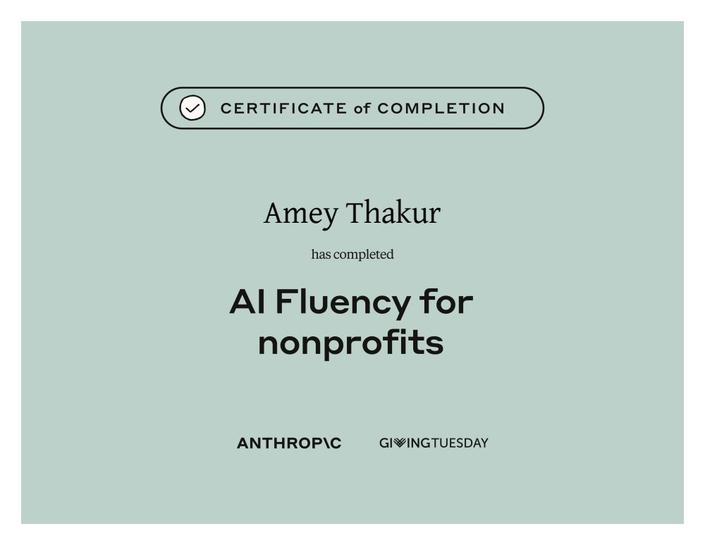</a> 
<b>AI Fluency for nonprofits</b> 
<a href="ai-fluency-for-nonprofits.pdf">PDF</a> · <a href="https://verify.skilljar.com/c/i5pueehh68uv">Verify</a> · <a href="https://academy.claude.com/verify/06b8ffc13e282f6c78d810d8a6575579">Badge</a> · Completed March 18, 2026
</td>
<td align="center" width="33%">
<a href="ai-fluency-for-small-businesses.pdf">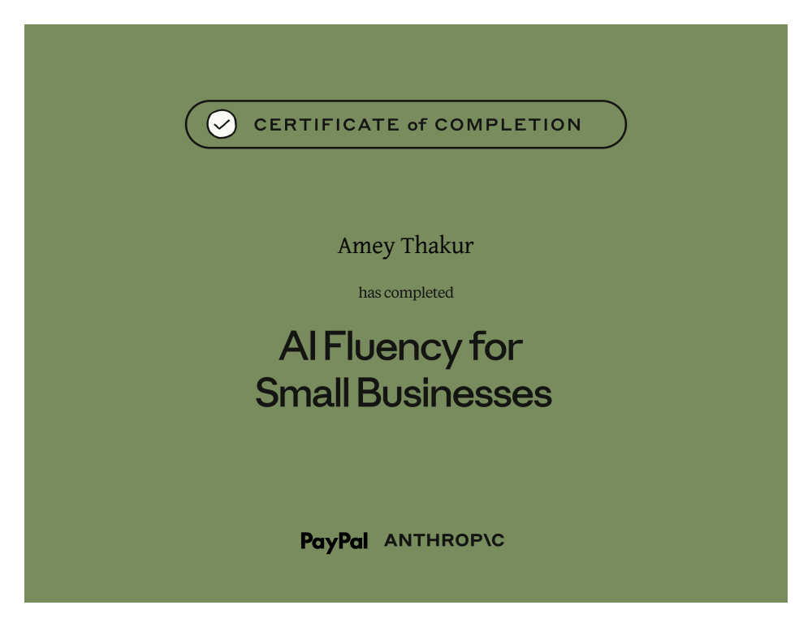</a> 
<b>AI Fluency for Small Businesses</b> 
<a href="ai-fluency-for-small-businesses.pdf">PDF</a> · <a href="https://verify.skilljar.com/c/ufedafc4f4ai">Verify</a> · <a href="https://academy.claude.com/verify/bf4fc4c30c02eb1d4aca988a212a44c8">Badge</a> · Completed June 6, 2026
</td>
<td align="center" width="33%">
<a href="ai-fluency-for-creative-work.pdf">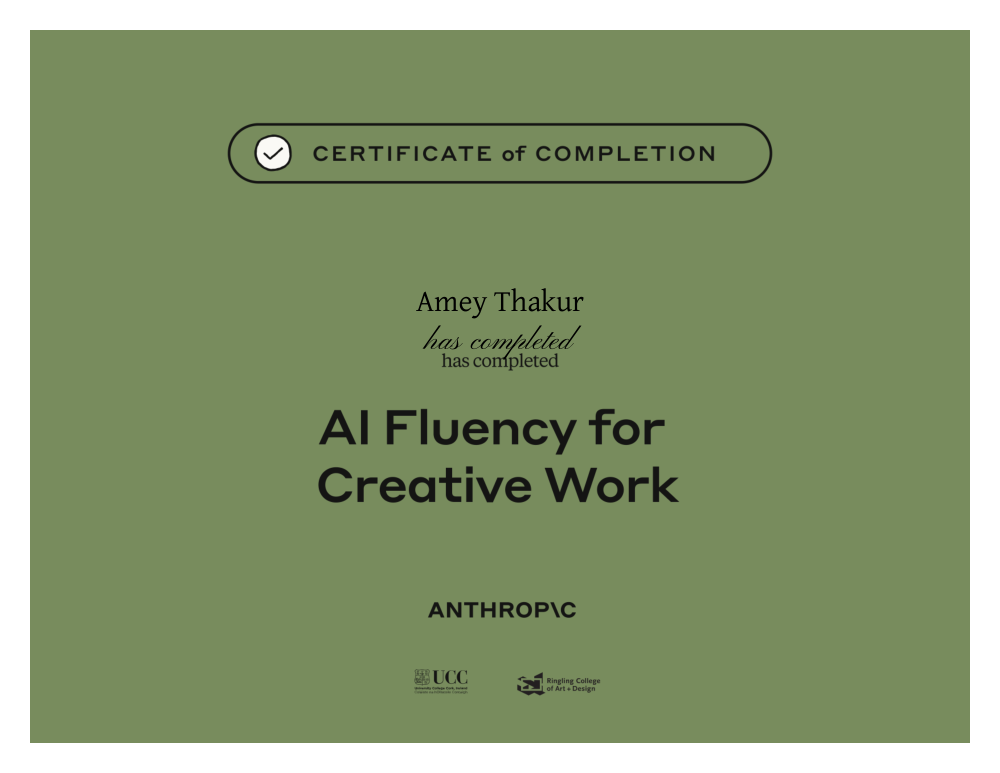</a> 
<b>AI Fluency for Creative Work</b> 
<a href="ai-fluency-for-creative-work.pdf">PDF</a> · <a href="https://verify.skilljar.com/c/pgq495ktrqqs">Verify</a> · <a href="https://academy.claude.com/verify/15dd1b6eef52c127e4e4111f1d15e72e">Badge</a> · Completed August 22, 2026
</td>
</tr>
<tr>
<td align="center" width="33%">
<a href="teaching-ai-fluency.pdf">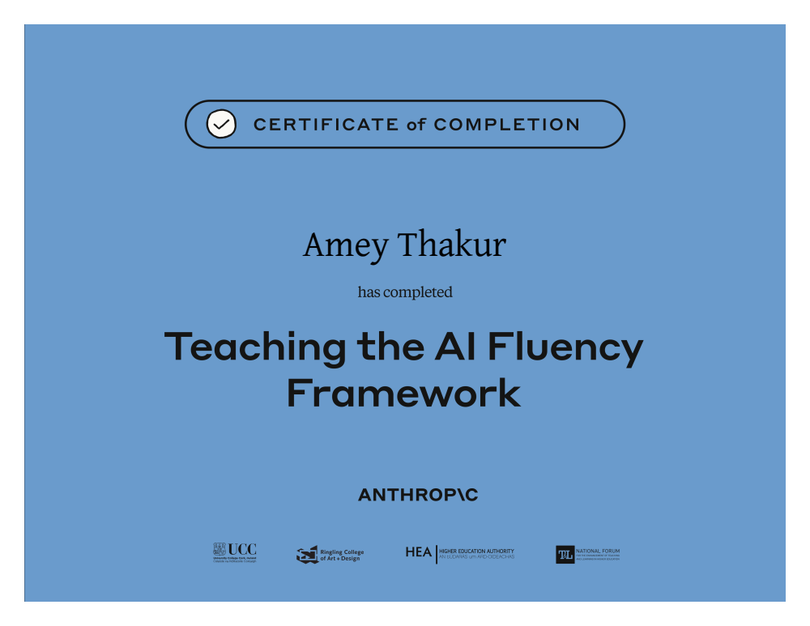</a> 
<b>Teaching AI Fluency</b> 
<a href="teaching-ai-fluency.pdf">PDF</a> · <a href="https://verify.skilljar.com/c/qsd5j744a2pc">Verify</a> · <a href="https://academy.claude.com/verify/59092b63e1969a2cb07ac14a57bd13ed">Badge</a> · Completed March 18, 2026
</td>
</tr>
</table>

## Claude Academy completion badges

Twenty-three courses were also issued a digital completion badge on
[Claude Academy](https://academy.claude.com), Anthropic's learning platform, and
there are twenty-four badges because AI Fluency for Creative Work issued twice,
on 22 and 27 August 2026. The rest: one on 18 March 2026, one on 27 March 2026,
twenty on 22 August 2026, and one on 30 August 2026. These verify separately
from the certificate PDFs above, on Anthropic's own domain rather than through
Skilljar.

Twenty-two of those courses also appear as a certificate above. Deploying Claude
Enterprise with Confidence issued a badge and no certificate, which is why the
two counts differ. Every badge below links to its verification page.

<!-- badges:start -->

<table>
<tr>
<td align="center" width="33%">
<a href="https://academy.claude.com/verify/13103f134da7befe9615ec2adfc8c50e" title="Verify Claude 101 on Claude Academy">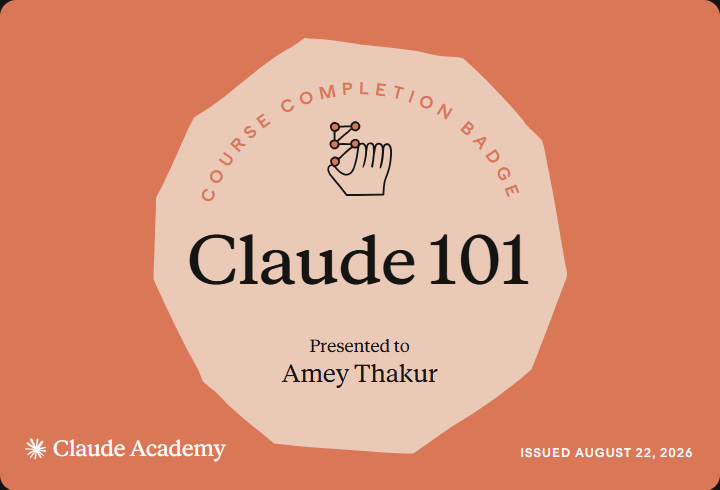</a>
 <b>Claude 101</b> <a href="https://academy.claude.com/verify/13103f134da7befe9615ec2adfc8c50e">Verify</a> · <code>13103f134da7…</code>
</td>
<td align="center" width="33%">
<a href="https://academy.claude.com/verify/c916ad7d1190ea2447bb2fcf3809ef16" title="Verify Claude Platform 101 on Claude Academy">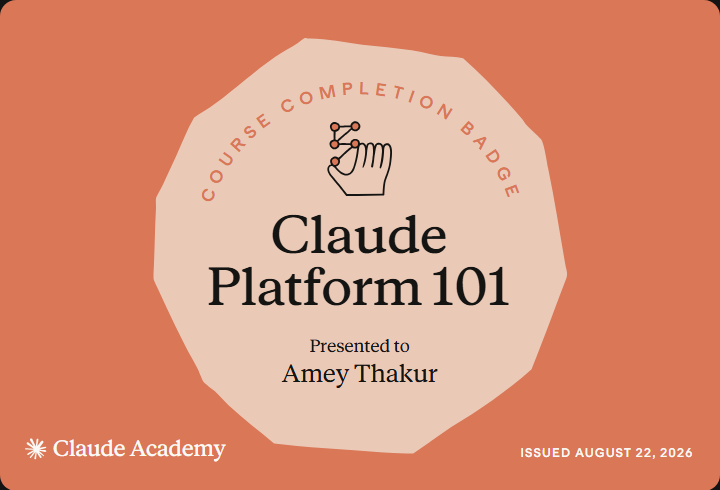</a>
 <b>Claude Platform 101</b> <a href="https://academy.claude.com/verify/c916ad7d1190ea2447bb2fcf3809ef16">Verify</a> · <code>c916ad7d1190…</code>
</td>
<td align="center" width="33%">
<a href="https://academy.claude.com/verify/47482157d8dbc48e39d22aaa49d6d9b1" title="Verify Claude Code 101 on Claude Academy">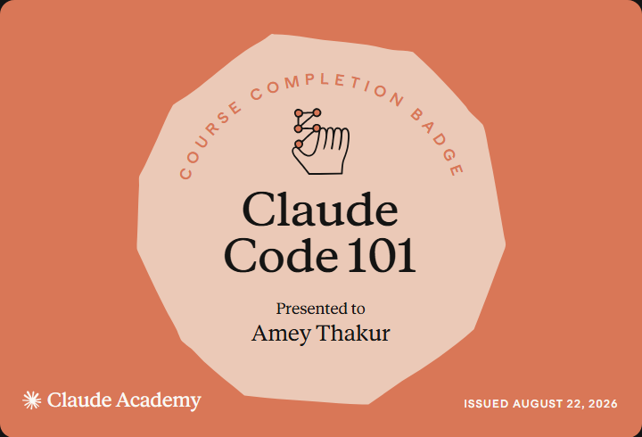</a>
 <b>Claude Code 101</b> <a href="https://academy.claude.com/verify/47482157d8dbc48e39d22aaa49d6d9b1">Verify</a> · <code>47482157d8db…</code>
</td>
</tr>
<tr>
<td align="center" width="33%">
<a href="https://academy.claude.com/verify/7f0839f0576b57f38658e8784e4c9a83" title="Verify Claude Code in Action on Claude Academy">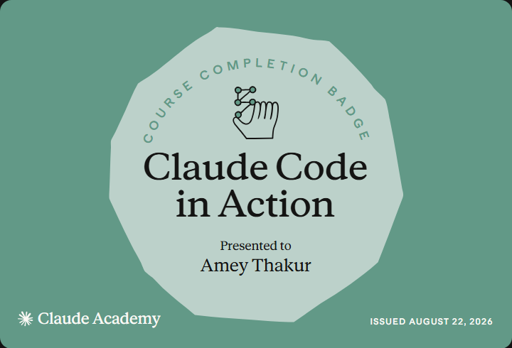</a>
 <b>Claude Code in Action</b> <a href="https://academy.claude.com/verify/7f0839f0576b57f38658e8784e4c9a83">Verify</a> · <code>7f0839f0576b…</code>
</td>
<td align="center" width="33%">
<a href="https://academy.claude.com/verify/7e0320325938630d9536a61078cc69a9" title="Verify Introduction to Claude Cowork on Claude Academy">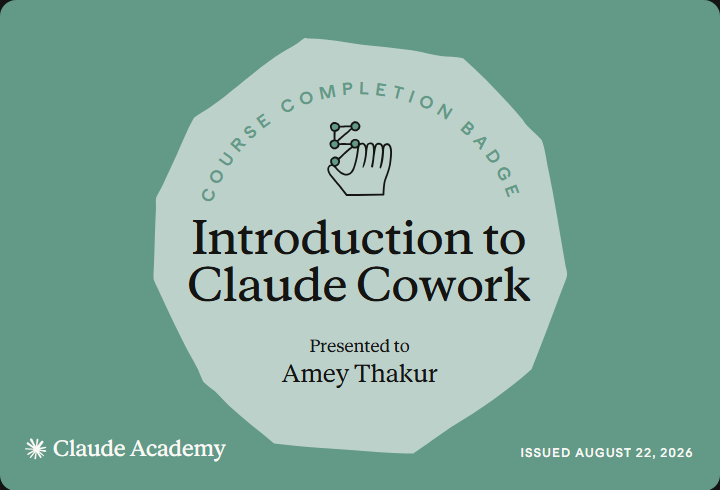</a>
 <b>Introduction to Claude Cowork</b> <a href="https://academy.claude.com/verify/7e0320325938630d9536a61078cc69a9">Verify</a> · <code>7e0320325938…</code>
</td>
<td align="center" width="33%">
<a href="https://academy.claude.com/verify/f6a1826e7f9054f5e41bf340a402fe58" title="Verify Building with the Claude API on Claude Academy">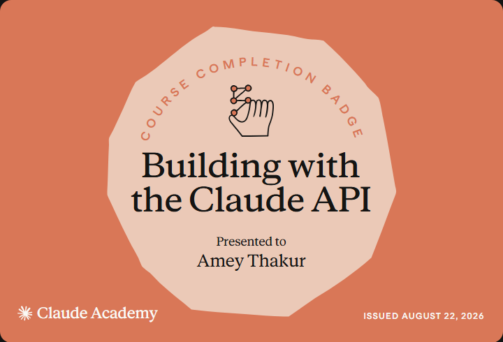</a>
 <b>Building with the Claude API</b> <a href="https://academy.claude.com/verify/f6a1826e7f9054f5e41bf340a402fe58">Verify</a> · <code>f6a1826e7f90…</code>
</td>
</tr>
<tr>
<td align="center" width="33%">
<a href="https://academy.claude.com/verify/0377c528acb2ecff93695ef9a9b56369" title="Verify Introduction to Model Context Protocol on Claude Academy">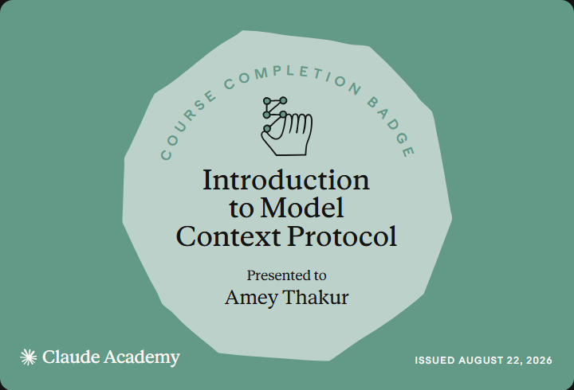</a>
 <b>Introduction to Model Context Protocol</b> <a href="https://academy.claude.com/verify/0377c528acb2ecff93695ef9a9b56369">Verify</a> · <code>0377c528acb2…</code>
</td>
<td align="center" width="33%">
<a href="https://academy.claude.com/verify/f7904c762c678c6e136bc866545a47e4" title="Verify Model Context Protocol: Advanced Topics on Claude Academy">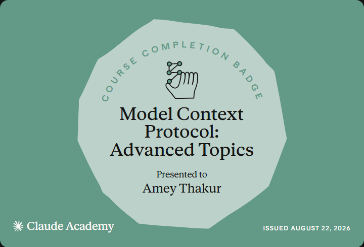</a>
 <b>Model Context Protocol: Advanced Topics</b> <a href="https://academy.claude.com/verify/f7904c762c678c6e136bc866545a47e4">Verify</a> · <code>f7904c762c67…</code>
</td>
<td align="center" width="33%">
<a href="https://academy.claude.com/verify/f568ff531665f510978b957c865f2af4" title="Verify Introduction to agent skills on Claude Academy">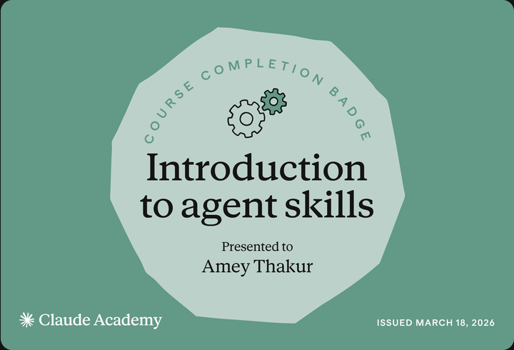</a>
 <b>Introduction to agent skills</b> <a href="https://academy.claude.com/verify/f568ff531665f510978b957c865f2af4">Verify</a> · <code>f568ff531665…</code>
</td>
</tr>
<tr>
<td align="center" width="33%">
<a href="https://academy.claude.com/verify/7c8ad2d367ff550c18bfb458cfcf5bd5" title="Verify Introduction to subagents on Claude Academy">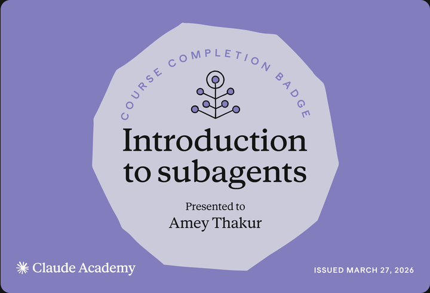</a>
 <b>Introduction to subagents</b> <a href="https://academy.claude.com/verify/7c8ad2d367ff550c18bfb458cfcf5bd5">Verify</a> · <code>7c8ad2d367ff…</code>
</td>
<td align="center" width="33%">

 <b>Claude with Amazon Bedrock</b> <a href="https://academy.claude.com/verify/8fb5e32058c121d343c34e341f56f375">Verify</a> · <code>8fb5e32058c1…</code>
</td>
<td align="center" width="33%">

 <b>Claude with Google Cloud's Vertex AI</b> <a href="https://academy.claude.com/verify/7ba0a150a9136308e1efa4b708fd9815">Verify</a> · <code>7ba0a150a913…</code>
</td>
</tr>
<tr>
<td align="center" width="33%">
<a href="https://academy.claude.com/verify/707d8089647cf8c2a99e833811ef8411" title="Verify AI Fluency: Framework &amp; Foundations on Claude Academy">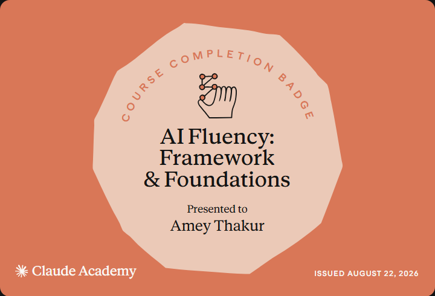</a>
 <b>AI Fluency: Framework &amp; Foundations</b> <a href="https://academy.claude.com/verify/707d8089647cf8c2a99e833811ef8411">Verify</a> · <code>707d8089647c…</code>
</td>
<td align="center" width="33%">
<a href="https://academy.claude.com/verify/09810945e075b401092e66d40dca790b" title="Verify AI Capabilities and Limitations on Claude Academy">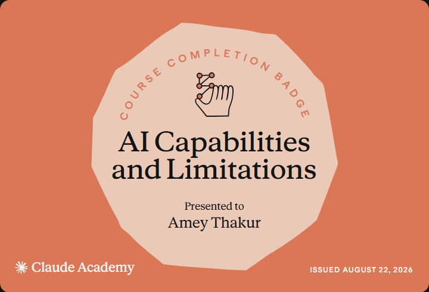</a>
 <b>AI Capabilities and Limitations</b> <a href="https://academy.claude.com/verify/09810945e075b401092e66d40dca790b">Verify</a> · <code>09810945e075…</code>
</td>
<td align="center" width="33%">
<a href="https://academy.claude.com/verify/6b67e458243ba97237de011382e2bedf" title="Verify AI Fluency for Builders on Claude Academy">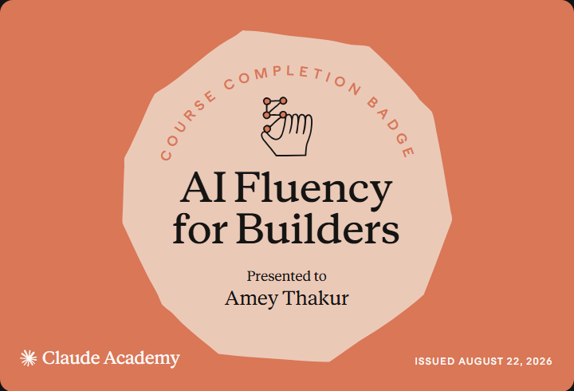</a>
 <b>AI Fluency for Builders</b> <a href="https://academy.claude.com/verify/6b67e458243ba97237de011382e2bedf">Verify</a> · <code>6b67e458243b…</code>
</td>
</tr>
<tr>
<td align="center" width="33%">
<a href="https://academy.claude.com/verify/3b7797440c1c56ed02ce4311c95313f1" title="Verify AI Fluency for educators on Claude Academy">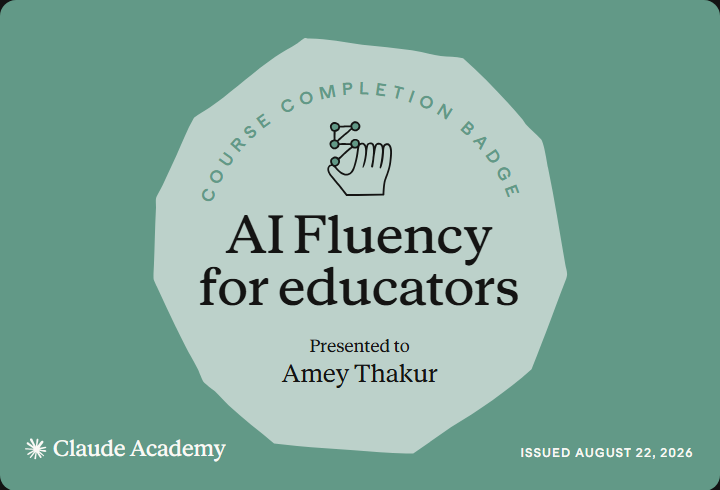</a>
 <b>AI Fluency for educators</b> <a href="https://academy.claude.com/verify/3b7797440c1c56ed02ce4311c95313f1">Verify</a> · <code>3b7797440c1c…</code>
</td>
<td align="center" width="33%">

 <b>AI Fluency for pK-12 Educators</b> <a href="https://academy.claude.com/verify/e8df6427179f879404b68f93cdbbb1b6">Verify</a> · <code>e8df6427179f…</code>
</td>
<td align="center" width="33%">
<a href="https://academy.claude.com/verify/84c728c31bdfe38efa149672b5477163" title="Verify AI Fluency for students on Claude Academy">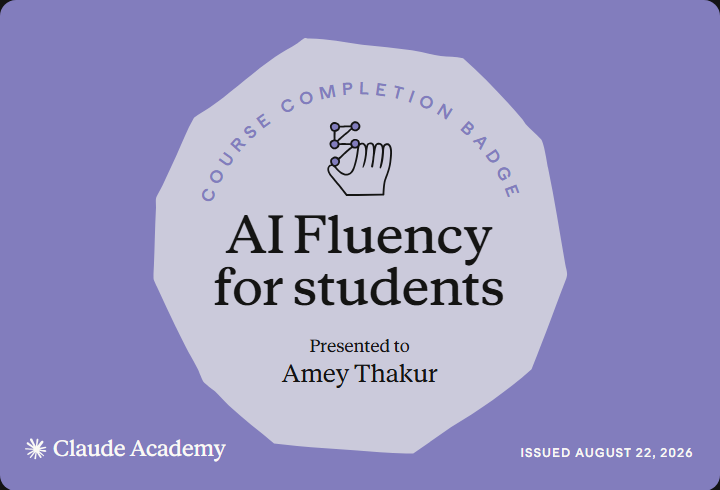</a>
 <b>AI Fluency for students</b> <a href="https://academy.claude.com/verify/84c728c31bdfe38efa149672b5477163">Verify</a> · <code>84c728c31bdf…</code>
</td>
</tr>
<tr>
<td align="center" width="33%">
<a href="https://academy.claude.com/verify/06b8ffc13e282f6c78d810d8a6575579" title="Verify AI Fluency for nonprofits on Claude Academy">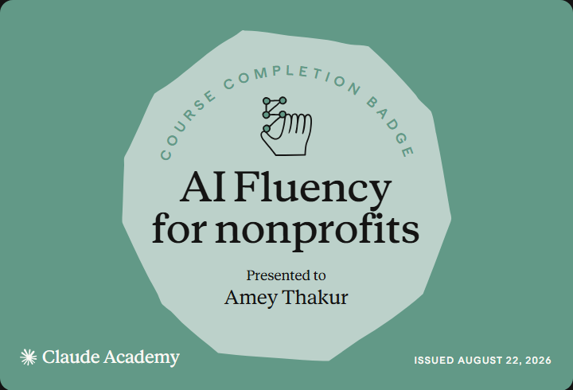</a>
 <b>AI Fluency for nonprofits</b> <a href="https://academy.claude.com/verify/06b8ffc13e282f6c78d810d8a6575579">Verify</a> · <code>06b8ffc13e28…</code>
</td>
<td align="center" width="33%">
<a href="https://academy.claude.com/verify/bf4fc4c30c02eb1d4aca988a212a44c8" title="Verify AI Fluency for Small Businesses on Claude Academy">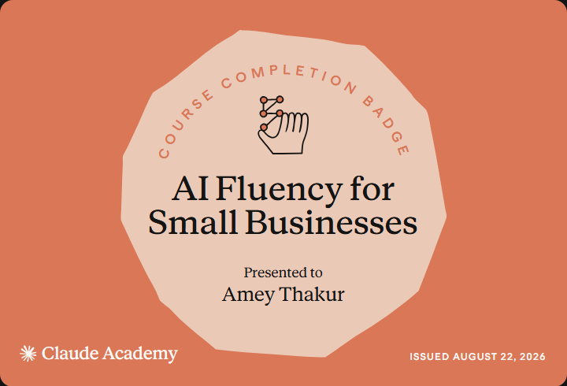</a>
 <b>AI Fluency for Small Businesses</b> <a href="https://academy.claude.com/verify/bf4fc4c30c02eb1d4aca988a212a44c8">Verify</a> · <code>bf4fc4c30c02…</code>
</td>
<td align="center" width="33%">
<a href="https://academy.claude.com/verify/59092b63e1969a2cb07ac14a57bd13ed" title="Verify Teaching AI Fluency on Claude Academy">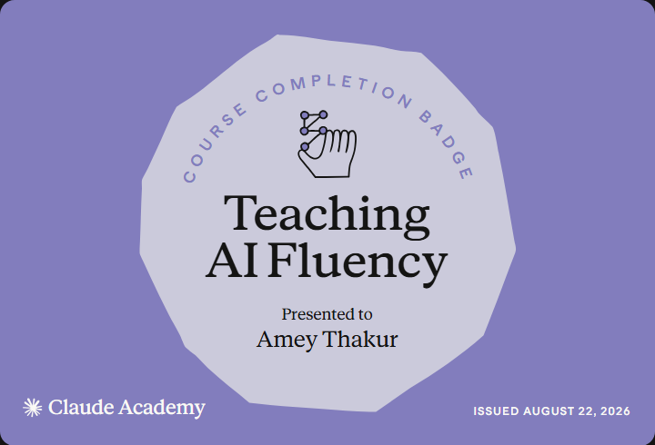</a>
 <b>Teaching AI Fluency</b> <a href="https://academy.claude.com/verify/59092b63e1969a2cb07ac14a57bd13ed">Verify</a> · <code>59092b63e196…</code>
</td>
</tr>
<tr>
<td align="center" width="33%">
<a href="https://academy.claude.com/verify/427635f5a6ca3fd34ed84bbdf7fb0275" title="Verify AI Fluency for Creative Work on Claude Academy">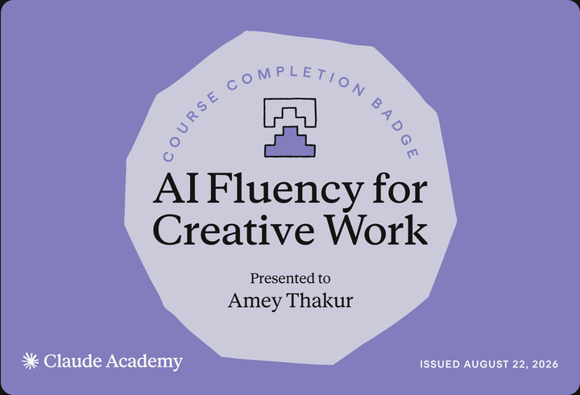</a>
 <b>AI Fluency for Creative Work</b> <a href="https://academy.claude.com/verify/427635f5a6ca3fd34ed84bbdf7fb0275">Verify</a> · <code>427635f5a6ca…</code>
</td>
<td align="center" width="33%">
<a href="https://academy.claude.com/verify/15dd1b6eef52c127e4e4111f1d15e72e" title="Verify AI Fluency for Creative Work on Claude Academy">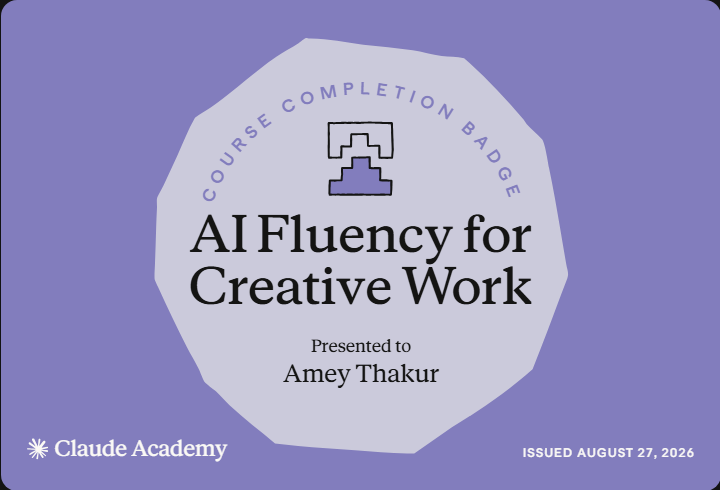</a>
 <b>AI Fluency for Creative Work</b> <a href="https://academy.claude.com/verify/15dd1b6eef52c127e4e4111f1d15e72e">Verify</a> · <code>15dd1b6eef52…</code>
</td>
<td align="center" width="33%">
<a href="https://academy.claude.com/verify/296e047c54c8ed404a99a7151c65ddf6" title="Verify Deploying Claude Enterprise with Confidence on Claude Academy">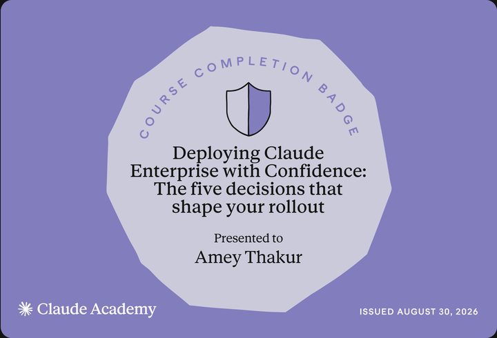</a>
 <b>Deploying Claude Enterprise with Confidence</b> <a href="https://academy.claude.com/verify/296e047c54c8ed404a99a7151c65ddf6">Verify</a> · <code>296e047c54c8…</code>
</td>
</tr>
</table>

<!-- badges:end -->

---

Facts last verified against the official sources on 2026-09-03. [Repository index](../README.md)
