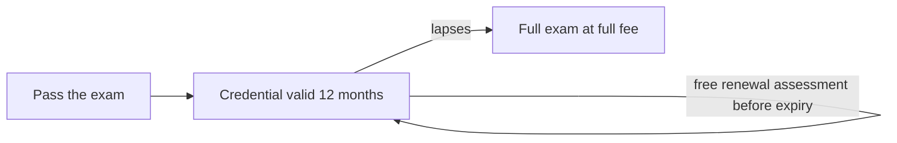

# Certification policies

A condensed reference to the policies that govern every Claude certification exam. The binding documents are the [Certification Terms and Conditions](../pdfs/policies/certification-terms-and-conditions.pdf) and the [Anthropic Certification Exam Policy](../pdfs/policies/anthropic-certification-exam-policy.pdf), which you accept when you register, together with the [official policies page](https://anthropic-partners.skilljar.com/page/policies-certifications). Where this summary and those documents differ, the documents apply.

## Ownership of the credential

Your certification belongs to you, not your employer. It stays with you if you change jobs, and a partner cannot reassign it to another person. If you certified through a partner organization, Anthropic may share your exam results and certification status with that organization.

## Scheduling, rescheduling, and cancellation

- Register and pay on the certification's page; Pearson VUE emails scheduling instructions afterward.
- There is no deadline for sitting a purchased exam.
- Reschedule or cancel free of charge until 24 hours before the appointment; cancellation in that window is fully refunded.
- Inside 24 hours, or on a no-show, the fee is forfeited.

## Retakes

- Waiting periods after a failed attempt: 14 days after the first, 30 days after the second, 90 days after the third.
- Maximum four attempts per exam in any rolling 12-month period. Both the waiting period and the attempt count reset when an exam moves to a new version.
- Limits apply per exam, so failing one certification does not block registering for a different one.
- Every attempt costs the full fee, with partner discounts applying as on a first attempt.
- After a pass, retaking to improve the score is not permitted.

## Validity and recertification

- Credentials are valid for 12 months from the date earned.
- On-time renewal is free: an open-book, non-proctored assessment on Partner Academy covering what changed since you certified, retakable as often as needed. Renewal extends the credential 12 months from the current expiration date.
- A lapsed credential requires passing the full exam again at full fee.
- If an exam is substantially updated, Anthropic may require holders to pass the current version to stay certified.
- Credentials earned before June 30, 2026 under the previous 6-month validity were automatically extended to 12 months from their original earned date.

## Proctoring, identification, and conduct

- Online or test center delivery; both are proctored and may be recorded audiovisually.
- You need a valid, unexpired government-issued photo ID exactly matching your registration name, and for online exams a private room and stable connection.
- Exams are closed book. Notes, documentation, phones, smart watches, headphones, secondary monitors, translation tools, and AI assistants are all prohibited.
- Confirmed cheating or fraud can lead to a required retake, mandatory test-center delivery in future, result invalidation, suspension or revocation of the credential, or a program ban. Serious cases such as theft of exam content may be referred for legal action, and patterns of misconduct within one partner organization can trigger action under that partner's agreement with Anthropic. Fees are not refunded, and all such decisions can be appealed.

## Confidentiality

Exam content is confidential. Taking an exam commits you not to share, reproduce, or discuss its questions in any form, including in study groups and online forums. This obligation is part of the terms accepted at registration, and it is why this repository's [discussion rules](../CONTRIBUTING.md#discussions) prohibit posting real exam questions.

## Appeals

- You can appeal a certification decision within 14 days of being notified, or within 14 days of your exam date for a result concern. Appeals go to Pearson VUE support.
- Appeals cover declined certifications, invalidated results, suspensions, revocations, program bars, and failed results you believe should have passed, including faulty questions or an exam that did not match the published guide.
- A disputed question does not by itself change a pass or fail. If a faulty question is confirmed to have affected your result, the remedy is a free retake, not a changed score.
- Technical problems during the exam and account issues go to support, not appeals.

## Reporting a problem with a question

Anyone, passing or failing, can report a question that looks factually wrong, unclear, multi-answer defensible, or out of scope for the exam guide. Reports go to Pearson, are distinct from appeals, and never count against you.

## Accommodations

Requested through [Pearson's accommodation process](https://www.pearsonvue.com/us/en/test-takers/accommodations.html), approved before scheduling, ideally 10 or more days ahead. Accommodations never affect scoring.

## Availability

Exams are not available everywhere; Anthropic may exclude specific countries or regions.

## The June 30, 2026 platform migration

Exam delivery moved to Pearson VUE and badging moved to Credly on June 30, 2026. Consequences that still matter:

- Architect – Foundations rose from 99 to 125 USD; registrations completed before that date were charged the old price.
- Registrations made before the migration were moved to Pearson in waves. If you paid but never received a Pearson link, email [certifications-support@anthropic.com](mailto:certifications-support@anthropic.com) rather than registering again, which would charge you twice.
- Failed Architect – Foundations attempts from before the migration were cleared: those candidates can retake with no waiting period.
- Pre-migration credentials were transferred to Credly and validity was extended from 6 to 12 months.
- The old platform's practice exam was retired; the sample questions inside each exam guide are the only official practice items.

---

Facts last verified against the official sources on 2026-07-27. [Repository index](../README.md)
