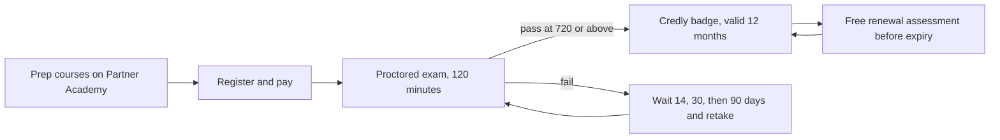

# Program guide

Everything about the certification program that is not specific to a single exam. The four certifications each have their own folder at the repository root with a study guide, the official exam guide PDF, study notes, and practice questions.

The whole journey, end to end:

| Page | Read it when |
| --- | --- |
| [Learning paths and courses](learning-paths.md) | Choosing a certification, or picking courses to prepare with |
| [Anthropic courses](courses.md) | All 21 official courses: what each teaches, where to enroll, and which exam it serves |
| [Study strategy](study-strategy.md) | You have chosen an exam and want a plan |
| [Official resources](resources.md) | Anthropic's documentation, courses, engineering articles, videos, and code, mapped to each exam |
| [Practice with Claude](practice.md) | Generating blueprint-based practice questions with Claude, within the exam NDA |
| [Registration and scheduling](registration.md) | Booking the exam, fixing partner email issues, preparing your machine |
| [Certification policies](policies.md) | Retakes, validity, renewal, appeals, proctoring rules |
| [Frequently asked questions](faq.md) | Quick answers, from pricing to badges |
| [Glossary](glossary.md) | The program's terms, defined once |
| [Official sources](official-sources.md) | Provenance of every mirrored PDF |
| [Maintenance guide](maintenance.md) | Contributing to or maintaining this repository |

Official PDFs in this folder: the [Anthropic Certification Exam Policy](anthropic-certification-exam-policy.pdf), the [Certification Terms and Conditions](certification-terms-and-conditions.pdf), and the illustrated [Exam Registration Guide](exam-registration-guide.pdf). Each certification's exam guide sits in that certification's folder.

---

[Repository index](../README.md)
